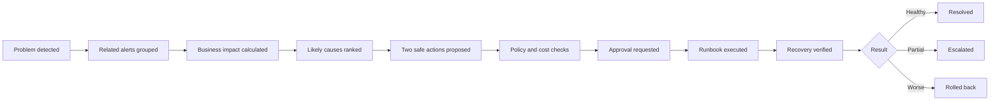
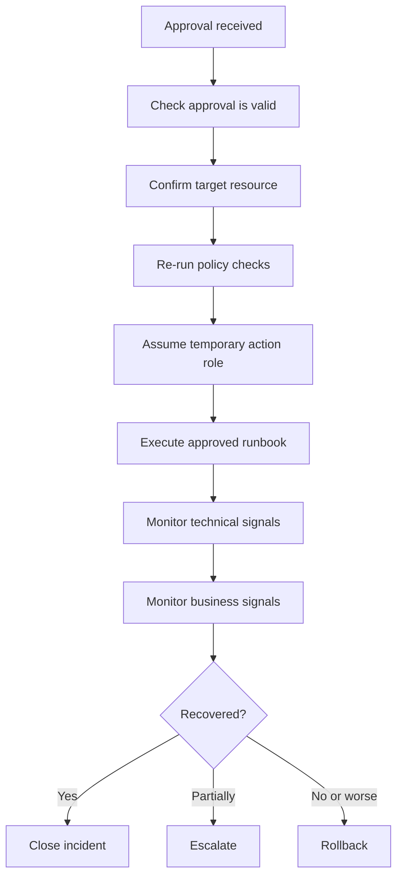
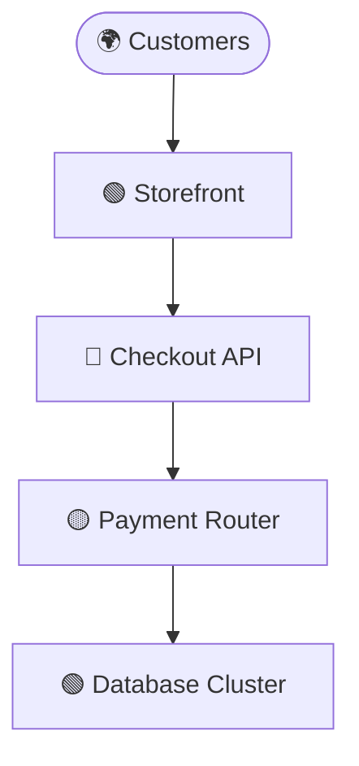

# 🛡️ Enterprise Resilience Agent
## User Guide, Operating Manual, and Results Handbook

> **Purpose**  
> Help business users, service owners, engineers, risk teams, and auditors understand incidents, approve safe actions, and interpret recovery results.

---

<div align="center">

**Multicloud** · **Human-controlled** · **Policy-governed** · **Auditable**

</div>

---

## 📘 Quick Navigation

| Section | What you will learn |
|---|---|
| [1. What the system does](#1-what-the-system-does) | The main purpose and value |
| [2. What the system does not do](#2-what-the-system-does-not-do) | Important safety limits |
| [3. Who should use each view](#3-who-should-use-each-view) | Executive, service-owner, engineering, and audit views |
| [4. Incident workflow](#4-the-normal-incident-workflow) | What happens from detection to recovery |
| [5. Incident card](#5-how-to-read-the-main-incident-card) | How to read every field |
| [6. Confidence](#6-understanding-confidence) | High, medium, and low confidence |
| [7. Root-cause results](#7-understanding-root-cause-results) | How to interpret hypotheses |
| [8. Recommended actions](#8-understanding-recommended-actions) | What the agent is proposing |
| [9. Approval](#9-when-to-approve-an-action) | When to approve, reject, or escalate |
| [10. Autonomy levels](#10-approval-and-autonomy-levels) | From observation to bounded automation |
| [11. Execution](#11-what-happens-after-approval) | What the system does after approval |
| [12. Result meanings](#12-understanding-execution-results) | Recovered, partial, rollback, escalated |
| [13. Service map](#13-how-to-read-the-service-map) | How technical dependencies connect to business |
| [14. Business metrics](#14-how-business-metrics-relate-to-technical-metrics) | Business language and technical evidence |
| [15. MLOps](#15-how-to-read-mlops-results) | Drift, quality, and model health |
| [16. LLMOps and AgentOps](#16-how-to-read-llmops-and-agentops-results) | Tool use, hallucination, prompt injection |
| [17. SecOps](#17-how-to-read-secops-results) | Security-specific handling |
| [18. FinOps](#18-how-to-read-finops-results) | Cost and budget interpretation |
| [19. Incident history](#19-how-to-read-incident-history) | What should be recorded |
| [20. Daily use](#20-daily-use-by-role) | Practical routine by user type |
| [21. Governance review](#21-weekly-and-monthly-review) | Weekly and monthly checks |
| [22. Good results](#22-what-good-results-look-like) | Signs the platform is working |
| [23. Weak results](#23-warning-signs) | Signs the platform needs improvement |
| [24. Common questions](#24-common-questions) | Frequently asked questions |
| [25. Glossary](#25-glossary) | Simple definitions |
| [26. Approval checklist](#26-quick-approval-checklist) | Final decision checklist |
| [27. Where to open the system](#27-where-to-open-the-system) | Which screen each person should use |

---

# 1. What the system does

The Enterprise Resilience Agent helps your organization understand and recover from system failures.

During an incident, it can:

| Step | What happens |
|---:|---|
| 1 | Detect abnormal behavior |
| 2 | Combine related alerts into one incident |
| 3 | Explain the customer and business impact |
| 4 | Identify likely causes |
| 5 | Find similar previous incidents |
| 6 | Recommend the two safest actions |
| 7 | Show risk, cost, and expected recovery time |
| 8 | Ask the correct person for approval |
| 9 | Run a tested recovery procedure |
| 10 | Confirm whether the system recovered |
| 11 | Roll back or escalate if the action failed |

> **Plain-English example**
>
> Checkout success dropped from 99.8% to 91%.  
> The most likely cause is that the checkout application has too few healthy workers for the current traffic.  
> No customer data appears to be lost.  
> The safest action is to add temporary capacity.  
> Estimated cost: **$0.60 per hour**.  
> Rollback: **automatic**.

---

# 2. What the system does not do

The agent does **not** receive unlimited access to your cloud environment.

### 🚫 The system must never

- Run arbitrary commands generated by the AI
- Delete production data without emergency approval
- Change security rules without authorization
- Hide technical evidence
- Invent certainty
- Treat a successful API response as proof of recovery
- Automatically perform high-risk database recovery
- Automatically perform regional failover
- Bypass policy or approval rules

> **Core safety rule**
>
> The AI investigates and recommends.  
> Tested, versioned, and policy-controlled runbooks perform the actual work.

---

# 3. Who should use each view

## 👔 Executive View

**Best for**

- Business leaders
- Product managers
- Operations managers
- Customer support leaders

**Shows**

| Item | Example |
|---|---|
| Customer journey affected | Checkout |
| Users affected | 9% of active shoppers |
| Business impact | Failed payments |
| Severity | Red |
| Expected recovery | 2–5 minutes |
| Approval required | Yes |
| Estimated temporary cost | $0.60/hour |

---

## 🧭 Service-Owner View

**Best for**

- Service owners
- Incident managers
- Technical product owners
- On-call leads

**Shows**

- Plain-language explanation
- Dependency map
- Top root-cause hypotheses
- Supporting and contradicting evidence
- Recommended actions
- Risk
- Blast radius
- Cost
- Duration
- Rollback plan
- Approval status

---

## 🛠️ Engineering and Audit View

**Best for**

- SRE
- Platform engineering
- Cloud engineering
- Security
- MLOps
- Auditors

**Shows**

- Raw metrics
- Logs
- Traces
- Cloud resource IDs
- Deployment changes
- Configuration changes
- Model version
- Prompt version
- Runbook version
- Policy decision
- Approver
- Before-and-after evidence
- Rollback details

---

# 4. The normal incident workflow



### You usually interact at three points

1. **Review the explanation**
2. **Approve, reject, or escalate**
3. **Review the final recovery result**

---

# 5. How to read the main incident card

```text
┌──────────────────────────────────────────────────────────────┐
│ 🔴 CHECKOUT SERVICE DEGRADED                                 │
├──────────────────────────────────────────────────────────────┤
│ BUSINESS IMPACT                                              │
│ About 9% of checkout attempts failed over 12 minutes.        │
│                                                              │
│ MOST LIKELY CAUSE                                            │
│ The checkout application has too few healthy workers.        │
│                                                              │
│ EVIDENCE                                                     │
│ • Request queue is growing                                   │
│ • Database remains healthy                                   │
│ • No security incident detected                              │
│ • Similar pattern seen in 6 previous incidents               │
│                                                              │
│ RECOMMENDED ACTION                                           │
│ Increase checkout workers from 5 to 7 for up to 30 minutes.  │
│                                                              │
│ Expected recovery: 2–5 minutes                               │
│ Additional cost: approximately $0.60 per hour                │
│ Risk: Low                                                    │
│ Rollback: Automatic                                          │
│                                                              │
│ [Approve action] [Escalate to on-call] [Show evidence]       │
└──────────────────────────────────────────────────────────────┘
```

---

## Status colors

| Color | Meaning |
|---|---|
| 🟢 Green | Healthy |
| 🟡 Yellow | Degraded, but the main service still works |
| 🔴 Red | Customers or critical operations are affected |
| ⚪ Gray | Not enough information |

> Color gives fast context.  
> Always read the written explanation before approving an action.

---

## Business impact

This explains the incident in business terms.

Examples:

- Failed checkouts
- Delayed payments
- Employees unable to log in
- Delayed reports
- Revenue at risk
- Regions affected

---

## Most likely cause

This is the agent's best current explanation.

> It is a **hypothesis**, not guaranteed truth.

---

## Evidence

Good evidence includes:

- Metric changes
- Log patterns
- Trace failures
- Deployment timing
- Dependency status
- Similar previous incidents
- Security findings
- Cost anomalies

---

## Recommended action

The action must come from the approved runbook catalogue.

It should never be a random command created by the AI.

---

## Expected recovery

An estimate based on:

- Runbook tests
- Previous incidents
- Service behavior
- Current system conditions

---

## Additional cost

The estimated temporary cloud cost.

Example:

> Adding two workers will cost approximately **$0.60 per hour**.

---

## Risk

Risk includes:

- Chance of making the incident worse
- Number of resources affected
- Reversibility
- Data sensitivity
- Business criticality
- Security impact
- Blast radius

---

## Rollback

Rollback explains how the change will be reversed if recovery fails.

---

# 6. Understanding confidence

Use simple levels:

| Level | Meaning | Recommended response |
|---|---|---|
| 🟢 High | Several signals agree and similar incidents exist | Low-risk approval may be reasonable |
| 🟡 Medium | Evidence supports the result, but gaps remain | Review evidence or ask on-call |
| 🔴 Low | Signals conflict or key telemetry is missing | Escalate |

### High confidence usually means

- Several independent signals agree
- Similar incidents exist
- Contradicting evidence is limited
- The runbook has succeeded before

### Medium confidence usually means

- The main evidence supports the cause
- Some evidence is missing
- Alternative explanations remain possible

### Low confidence usually means

- Signals conflict
- The incident is new
- Important telemetry is missing
- No close historical match exists

> **Important**
>
> A confidence score is not proof.  
> Confidence should be calibrated using historical incident results.

---

# 7. Understanding root-cause results

The system may show several hypotheses.

| Rank | Possible cause | Confidence | Meaning |
|---:|---|---|---|
| 1 | Application worker saturation | Medium-high | Best current explanation |
| 2 | Payment provider slowdown | Medium | Possible contributing factor |
| 3 | Database connection limit | Low | Some evidence exists, but signals do not fully match |

### Supporting evidence

Facts that make a cause more likely.

Example:

- Worker count dropped
- Queue depth increased
- Database stayed healthy

### Contradicting evidence

Facts that make a cause less likely.

Example:

- Traffic increased only slightly
- No memory pressure was detected

> A trustworthy result should show both supporting and contradicting evidence.

---

# 8. Understanding recommended actions

The system normally shows two options.

## ⚡ Action 1 — Recommended recovery

The safest action with the best expected result.

Example:

> Increase checkout workers from 5 to 7 for up to 30 minutes.

## 🧑‍💻 Action 2 — Alternative or escalation

Example:

> Roll back the latest deployment after engineer approval.

or:

> Take no automatic action and notify the on-call engineer.

### Every action should show

| Field | Why it matters |
|---|---|
| What will change | Makes the action understandable |
| Why it is suggested | Connects action to evidence |
| Target service | Prevents wrong-resource execution |
| Environment | Confirms production, staging, or development |
| Maximum duration | Limits exposure |
| Expected recovery | Sets expectations |
| Additional cost | Supports business approval |
| Risk | Shows operational danger |
| Blast radius | Shows how much could be affected |
| Preconditions | Confirms the action is still valid |
| Verification | Defines success |
| Rollback | Defines recovery from failure |
| Required approval | Confirms authority |

---

# 9. When to approve an action

## ✅ Approve when

- The business impact is understood
- The target service is correct
- The action is low or acceptable risk
- The cost is acceptable
- Rollback exists
- The action is within your authority
- Policy allows it
- Evidence is sufficient

## ⛔ Do not approve when

- The target resource is unclear
- The explanation is confusing
- Confidence is low for a high-risk action
- Rollback is missing
- Sensitive data may be affected
- The incident may be security-related
- Blast radius is too large
- A change freeze blocks the action
- You are not authorized

Use **Escalate to on-call** in these cases.

---

# 10. Approval and autonomy levels

| Level | Name | What the system may do |
|---:|---|---|
| 0 | Observe | Read telemetry and explain |
| 1 | Recommend | Suggest actions only |
| 2 | Human-approved execution | Execute only after approval |
| 3 | Bounded autonomy | Execute low-risk actions within limits |
| 4 | Conditional autonomy | Execute short approved recovery sequences |
| 5 | Emergency-only | High-risk actions require senior approval |

### Examples of Level 3 actions

- Replace one unhealthy stateless task
- Retry an idempotent job
- Increase workers from 5 to 7 when the approved maximum is 10
- Remove one unhealthy endpoint when enough capacity remains

### Emergency-only examples

- Production database restore
- Regional failover
- Large capacity increase
- IAM policy change
- Encryption change
- Destructive data operation

---

# 11. What happens after approval



The agent cannot replace the approved action with a different action.

---

# 12. Understanding execution results

## 🟢 RECOVERED

**Meaning**

- Original symptoms disappeared
- Business KPIs returned to normal
- No serious new error appeared
- The service stayed stable

**Example**

> Checkout success returned from 91% to 99.7%.  
> Queue depth returned to normal within four minutes.  
> No new database or payment errors appeared.

---

## 🟡 PARTIALLY_RECOVERED

**Meaning**

- Some symptoms improved
- The service is still not fully healthy
- Another cause may remain

**Example**

> Checkout latency improved from 8.2 seconds to 3.5 seconds, but remains above the 2-second target. The payment provider is still slow. The incident has been escalated.

---

## ⚪ NO_CHANGE

**Meaning**

- The action completed
- Important signals did not improve

**Example**

> Worker count increased successfully, but checkout failures remain at 8%. Worker capacity was probably not the main cause.

---

## 🔴 WORSE

**Meaning**

- Errors or business impact increased
- Automatic rollback should begin

**Example**

> Error rate increased from 8% to 14%. The system stopped the action and restored the previous configuration.

---

## 🔄 ROLLBACK_COMPLETED

**Meaning**

- The attempted change did not produce an acceptable result
- The previous state was restored

**Example**

> The temporary capacity change was reversed. The incident remains open and the on-call team has been notified.

---

## 🚨 ESCALATED

**Meaning**

The system cannot continue safely.

**Common reasons**

- Low confidence
- High-risk action required
- Missing telemetry
- Policy block
- Failed rollback
- Security concern
- Repeated unsuccessful actions

---

# 13. How to read the service map



The map answers:

- Where is the problem?
- Which service depends on it?
- Which customer journey is affected?
- Are healthy alternatives available?
- How large is the blast radius?

### Map colors

| Color | Meaning |
|---|---|
| 🟢 Green | Healthy |
| 🟡 Yellow | Degraded |
| 🔴 Red | Failing |
| ⚪ Gray | Unknown |
| 🔵 Blue | External or shared dependency |

---

# 14. How business metrics relate to technical metrics

| Business metric | Technical signals behind it |
|---|---|
| Checkout success | HTTP errors, payment failures, application exceptions |
| Payment speed | API latency, database latency, queue delay |
| Login success | Identity errors, token validation, database health |
| Order processing time | Queue depth, worker count, downstream response |
| Search availability | Search cluster health, API latency, indexing backlog |
| Report freshness | Pipeline completion, data quality, schedule delay |

> Non-technical users see business impact first.  
> Engineers can select **Show evidence** for the technical detail.

---

# 15. How to read MLOps results

## Data drift

**Meaning**

Live input data looks different from the training data.

**Possible impact**

- Lower accuracy
- Need for evaluation
- Need for retraining
- Need to use a previous model

---

## Prediction drift

**Meaning**

The pattern of model outputs changed.

> Prediction drift does not always mean the model is wrong.  
> Real customer behavior may also have changed.

---

## Model quality degradation

**Meaning**

The model performs worse on confirmed outcomes or evaluation data.

**Possible actions**

- Pause rollout
- Route traffic to the previous model
- Start an evaluation
- Require human review
- Retrain after approval

---

## Shadow mode

**Meaning**

A new model runs in the background without controlling production.

Compare:

- Accuracy
- False alarms
- Missed incidents
- Latency
- Cost
- Stability

---

# 16. How to read LLMOps and AgentOps results

## Unsupported claim warning

**Meaning**

The agent made a statement without enough evidence.

**Expected response**

- Lower confidence
- Show missing evidence
- Prevent automatic action if important

---

## Tool policy violation

**Meaning**

The agent requested a tool or action outside its permission.

**Expected response**

- Block the request
- Record the event
- Notify security if serious
- Do not execute

---

## Prompt-injection warning

**Meaning**

Text from logs, tickets, or documents may be trying to manipulate the agent.

**Expected response**

- Treat the text as untrusted
- Ignore embedded instructions
- Restrict tools
- Escalate if sensitive

---

## Retrieval quality warning

**Meaning**

The retrieved incidents or runbooks may not be relevant enough.

**Expected response**

- Lower confidence
- Refine the search
- Ask for human review

---

## Model fallback

**Meaning**

The normal LLM was unavailable, too slow, too expensive, or failed a safety check.

**Possible system behavior**

- Use an approved fallback model
- Use deterministic templates
- Limit functionality
- Escalate

---

# 17. How to read SecOps results

Security incidents require stricter handling.

### Examples

- Suspicious login
- Unexpected IAM change
- Secret exposure
- Unusual network access
- Malware detection
- Audit logging disabled

### During a security incident

- Automatic changes may be restricted
- Security approval may be required
- Evidence must be preserved
- Forensic information must not be destroyed
- High-risk remediation should be escalated

---

# 18. How to read FinOps results

The platform shows the expected cost of remediation.

Example:

> Adding two workers will cost approximately **$0.60 per hour**.

| Cost result | Meaning |
|---|---|
| Within safe limits | Action remains within budget |
| Near limit | Manager approval may be required |
| Over limit | Policy blocks the action |
| Cost anomaly | Existing spending is already abnormal |

> Cost is one input.  
> A cheap action may still be dangerous.  
> An expensive action may be justified during a severe incident.

---

# 19. How to read incident history

Each completed incident should record:

- What happened
- Start time
- Detection time
- Customer impact
- Root cause
- Evidence
- Action taken
- Approver
- Runbook version
- Recovery time
- Additional cost
- Rollback status
- Lessons learned

### Example incident history card

```text
11:24 AM | 🟢 Recovery complete

What happened:
The storefront image-processing queue became overloaded.

Action:
Capacity increased from 4 workers to 6 workers for 30 minutes.

Result:
Queue depth returned to normal in 1 minute 42 seconds.

Customer impact:
No transactions were lost. Image updates were delayed for 3 minutes.

Cost:
Approximately $0.28 additional cloud cost.

Verification:
Passed.

Follow-up:
Review why the seasonal baseline did not predict the traffic increase.
```

---

# 20. Daily use by role

## 👔 Managers

1. Check overall business-service health.
2. Review red or yellow journeys.
3. Read the plain-language explanation.
4. Review cost, risk, and recovery time.
5. Approve only actions within your authority.
6. Escalate unclear or high-risk incidents.

---

## 🧭 Service owners

1. Confirm the affected service.
2. Review the dependency map.
3. Review the top two cause hypotheses.
4. Read supporting and contradicting evidence.
5. Review runbook, rollback, and verification.
6. Approve, reject, or escalate.

---

## 🛠️ Engineers

1. Inspect raw telemetry.
2. Review recent deployments and changes.
3. Verify the target resource.
4. Review policy output.
5. Review model and prompt versions.
6. Confirm runbook parameters.
7. Observe execution.
8. Add the final root cause and lesson learned.

---

## 📋 Auditors

1. Search by incident, service, date, approver, or runbook.
2. Review immutable execution history.
3. Confirm least-privilege access.
4. Confirm policy checks.
5. Confirm approval.
6. Confirm verification and rollback.
7. Export evidence when required.

---

# 21. Weekly and monthly review

## Weekly operations review

Review:

- Frequent incident types
- Repeat incidents
- Rejected recommendations
- Slow approvals
- Runbooks with low success rates
- Missing telemetry
- Model drift
- High remediation cost

## Monthly governance review

Review:

- New runbooks
- Runbook version changes
- Autonomy-level changes
- Policy changes
- Unauthorized attempts
- Prompt-injection findings
- Security exceptions
- Cost ceilings
- Recovery-test results
- Services eligible for more autonomy

---

# 22. What good results look like

## Operational improvement

- Faster detection
- Less alert noise
- Faster investigation
- Faster recovery
- Fewer repeated incidents
- Better SLO performance

## Better decision quality

- Correct service identified
- True cause appears in the top two
- Evidence is clear
- Dangerous actions are blocked
- Human rejection decreases
- Confidence becomes better calibrated

## Safer automation

- High runbook success rate
- Low rollback rate
- Zero unauthorized changes
- Zero unaudited actions
- Automatic escalation when evidence is weak

## Business improvement

- Less downtime
- Fewer failed customer journeys
- Fewer support tickets
- Less on-call work
- Lower incident cost
- Faster understanding by managers

---

# 23. Warning signs

The platform needs improvement when:

- Too many alerts remain ungrouped
- One alert creates several incidents
- Explanations use jargon without business impact
- Confidence is often high and wrong
- Root cause is rarely in the top two
- Recommendations are generic
- Approvers reject many actions
- Runbooks often require rollback
- Verification ignores customer outcomes
- Cost is not tracked
- Evidence comes from the wrong service
- Security or policy warnings are bypassed

Possible causes:

- Poor telemetry
- Incomplete service mapping
- Weak evaluation
- Weak policies
- Unsafe runbook design
- Missing business KPIs
- Poorly calibrated models

---

# 24. Common questions

## Is the agent fully autonomous?

No. Autonomy increases only after a runbook proves safe and reliable.

## Can a non-technical manager approve actions?

Yes, but only actions assigned to that person's approval level.

## Can the agent make a mistake?

Yes. That is why it must show evidence, confidence, policy results, rollback, and verification.

## What happens if the agent is unavailable?

Normal monitoring and alerting should continue. Existing runbooks and on-call processes remain available.

## What happens if the cloud provider is unavailable?

The system should use cached topology, local incident state, and fallback communication. High-risk actions should stop.

## Can the platform manage AWS, GCP, and Azure together?

Yes. The incident and approval model stays common, while cloud-specific adapters perform provider operations.

## Does the system replace SRE or operations teams?

No. It reduces repetitive work. People still own policy, complex incidents, runbook design, exceptions, and improvement.

---

# 25. Glossary

| Term | Simple meaning |
|---|---|
| AIOps | Using analytics and ML to improve IT operations |
| Anomaly | Behavior that differs from the expected baseline |
| Blast radius | How much could be affected |
| Business KPI | A measure tied to business outcome |
| Confidence | Strength of the available evidence |
| Correlation | Grouping signals from the same incident |
| Data drift | Live data changed compared with training data |
| Incident | A problem affecting or threatening service quality |
| MLOps | Building, deploying, monitoring, and governing ML systems |
| LLMOps | Monitoring and governing language models |
| AgentOps | Monitoring and controlling AI-agent decisions and tools |
| Policy check | A deterministic allow, block, or approval decision |
| Root cause | The underlying problem |
| Runbook | A tested and versioned operational procedure |
| Shadow mode | Running a new model without controlling production |
| SLO | A reliability or performance target |
| Verification | Confirming the service really recovered |

---

# 26. Quick approval checklist

Before approving, confirm:

- [ ] I understand the customer or business impact
- [ ] The target service is correct
- [ ] The evidence is sufficient
- [ ] The action is registered and versioned
- [ ] The risk is acceptable
- [ ] The cost is acceptable
- [ ] The blast radius is limited
- [ ] Rollback is available
- [ ] Verification is defined
- [ ] I am authorized to approve
- [ ] No security or compliance block exists

> When any important item is missing, select **Escalate to on-call**.

---

# 27. Where to open the system

If you are not technical, start with these screens:

| Need | Open this page | Why |
|---|---|---|
| See the big picture | `/overview` | Shows active incidents, customer impact, and current approvals |
| Decide whether to approve | `/approvals` | Shows the proposed action, risk, cost, and expected result |
| Check if the platform is fully connected | `/platform` | Shows whether the dashboard, API, database, Redis, and AWS adapter are ready |
| Review history later | `/audit` | Shows what happened, who approved it, and the final outcome |

If the system is deployed with the provided container stack, these pages are available from the same browser window, usually at:

`http://your-dashboard-url/overview`

---

# Final summary

A successful result is not:

> The cloud action completed.

A successful result is:

> The affected customer journey recovered, the action stayed within policy and cost limits, no new problem appeared, the result was verified, and every decision was recorded for review.
